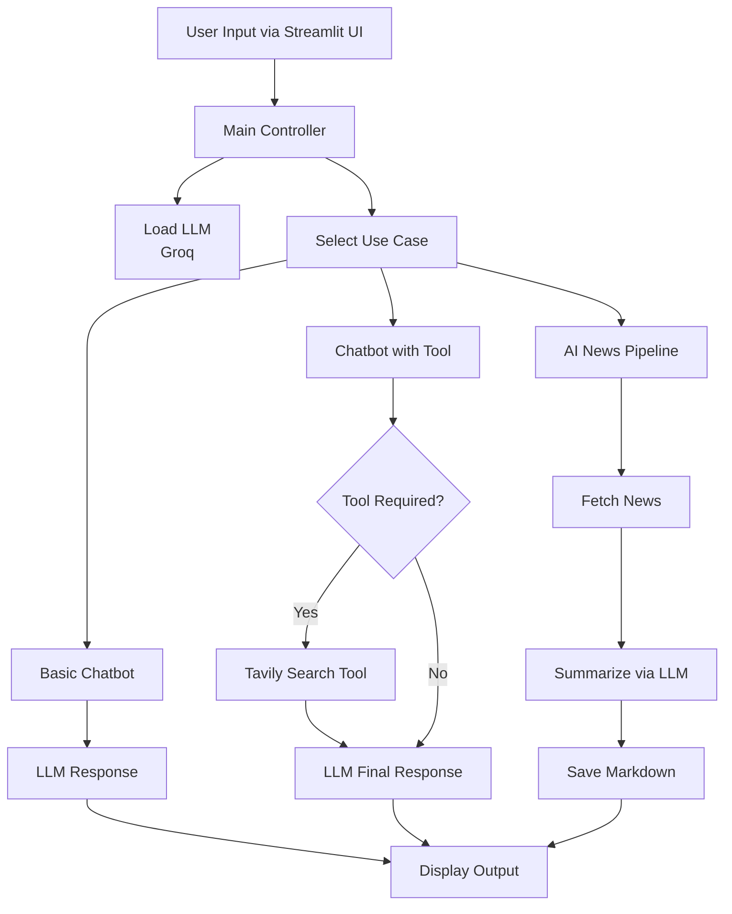
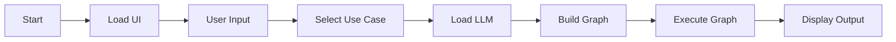
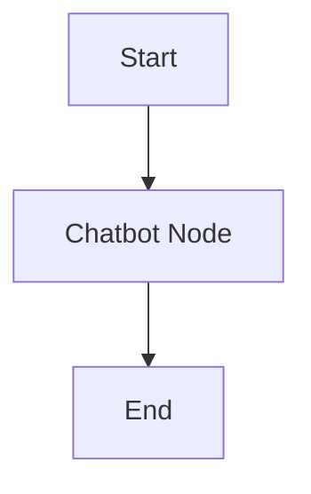
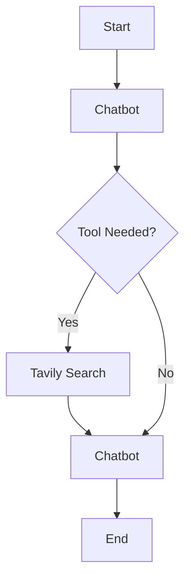
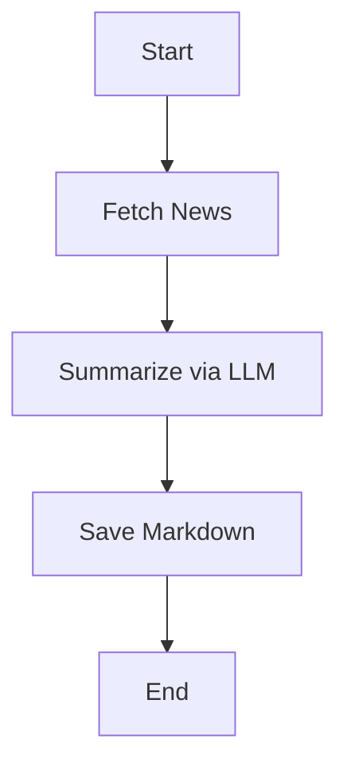

### ![Watch Demo]
https://github.com/user-attachments/assets/5f9ece7c-3975-4f52-9bc3-d6c2db2f38aa


#  LangGraph Agentic AI Application

> **Stateful Agentic AI System using LangGraph, Groq LLM, and Tavily Search**


##  Overview

This project is a **production-style Agentic AI system** that orchestrates **stateful workflows** using LangGraph.

It integrates:

* 🤖 **Groq LLM (LLaMA models)**
* 🌐 **Tavily Web Search API**
* 🎨 **Streamlit UI**

Supports:

* 🗣️ Chatbot
* 🌍 Tool-augmented chatbot
* 📰 AI News automation pipeline

---

##  Tech Stack

* **LangGraph** – Workflow orchestration
* **Groq LLM** – Fast inference (LLaMA models)
* **Tavily API** – Real-time web search
* **Streamlit** – UI layer
* **Python** – Core backend

---

# 🏗️ Architecture Diagram



---

# ⚙️ High-Level Workflow



---

# 📂 Project Structure

```bash
app.py
src/
├── LanggraphAgenticAI/
│   ├── main.py
│   ├── Graph/
│   │   └── graph_builder.py
│   ├── Nodes/
│   │   ├── basic_chatbot_node.py
│   │   ├── chatbot_with_tool_node.py
│   │   └── ai_news_node.py
│   ├── Tools/
│   │   └── search_tool.py
│   ├── state/
│   │   └── state.py
│   ├── LLMS/
│   │   └── groqllm.py
│   └── UI/
│       ├── uiconfigfile.ini
│       ├── uiconfigfile.py
│       └── StreamlitUI/
│           ├── loadui.py
│           └── display_result.py
```

---

#  Core Concepts

##  Stateful AI System

```python
class State(TypedDict):
    messages: Annotated[list, add_messages]
```

* Maintains conversation context
* Enables multi-step reasoning

---

# 🤖 Use Case 1: Basic Chatbot



* Direct LLM interaction
* Simple conversational flow

---

# 🌍 Use Case 2: Chatbot with Web Search



### ⚙️ How it works:

* LLM decides tool usage
* Executes web search
* Returns enriched response

 Uses: `tools_condition`
Enables **true agentic behavior**

---

# 📰 Use Case 3: AI News Pipeline



###  Pipeline Steps

1. Fetch latest AI news (Tavily API)
2. Summarize using LLM
3. Save as markdown file

📁 Output:

```
./AINews/daily_summary.md
```

---

#  System Layers

## 1️⃣ Entry Point (`app.py`)

* Launches Streamlit app

## 2️⃣ Controller (`main.py`)

* Handles:

  * UI loading
  * Input processing
  * Graph execution

## 3️⃣ UI Layer

* Dynamic config via `.ini`
* Stores user inputs
* Clean modular design

## 4️⃣ LLM Layer

```python
ChatGroq(api_key, model)
```

* Dynamic model selection
* Fast inference

## 5️⃣ LangGraph Layer

* Stateful execution
* Conditional routing
* Multi-step workflows

---

#  Why This Project Stands Out

✔️ Graph-based AI architecture
✔️ Real-world agent workflows
✔️ Tool-integrated LLM system
✔️ Modular & scalable design
✔️ Production-style pipeline

>  This is NOT just a chatbot — it's a **full Agentic AI System**

---

#  Installation

## 1️⃣ Clone

```bash
git clone https://github.com/awasthi-anjali/Agentic-ChatBot.git
cd langgraph-agentic-ai
```

## 2️⃣ Virtual Environment

```bash
python -m venv venv
source venv/bin/activate
```

## 3️⃣ Install Dependencies

```bash
pip install -r requirements.txt
```

## 4️⃣ Set API Keys

* `GROQ_API_KEY`
* `TAVILY_API_KEY`

Enter via UI

---

## ▶️ Run App

```bash
streamlit run app.py
```

---

#  Use Cases

| Feature        | Description             |
| -------------- | ----------------------- |
| 🗣️ Chatbot    | Basic LLM interaction   |
| 🌍 Web Chatbot | LLM + Search tool       |
| 📰 AI News     | Automated news pipeline |

---

#  Future Improvements

* Memory persistence
* Multi-agent collaboration
* Vector database (RAG)
* Authentication system
* AWS deployment
* Streaming responses

---

# Summary

> Built a **stateful Agentic AI system using LangGraph**, integrating Groq LLM and Tavily Web Search API. Designed multi-step AI workflows with conditional routing, tool-based reasoning, and a Streamlit UI for real-time interaction.

---


